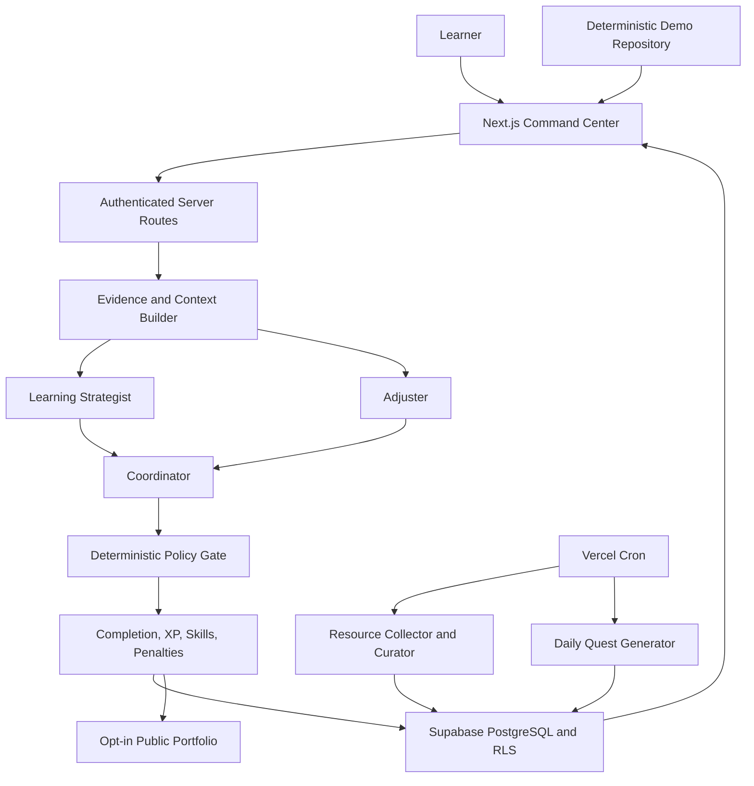

# MLevelUp

**Ready to level up? Let's get it!**

MLevelUp turns career growth into a game worth playing. It is an AI training system for aspiring machine learning engineers that assigns hard but achievable missions, reviews evidence of completed work, and converts measurable progress into portfolio-ready proof.

Instead of rewarding passive course consumption or self-reported checkboxes, MLevelUp asks the learner to do the work: run an experiment, submit evidence, receive structured feedback, and earn progression through verified results.

Built for **OpenAI Build Week** with Codex, GPT-5.6, Next.js, Supabase, and Vercel.

## Try MLevelUp

| Experience | Link | Best for |
| --- | --- | --- |
| Live product | [m-level-up.vercel.app](https://m-level-up.vercel.app/) | Product overview and real sign-in |
| 90-second guided demo | [Start the guided demo](https://m-level-up.vercel.app/demo?guided=1&restart=1) | The fastest judge walkthrough |
| Interactive sandbox | [Enter the sandbox](https://m-level-up.vercel.app/demo/sandbox?restart=1) | Exploring the full product with a fake learner account |
| Demo portfolio | [View Alex's public proof](https://m-level-up.vercel.app/p/demo-ml-engineer) | Recruiter-facing evidence and skill coverage |
| Source code | [github.com/barrychung1112/MLevelUp](https://github.com/barrychung1112/MLevelUp) | Architecture, tests, and implementation |

All links above are public. The guided demo and sandbox require no account, API key, or external service response.

## Judge Quickstart

### Guided story

Open the [90-second guided demo](https://m-level-up.vercel.app/demo?guided=1&restart=1) and follow its single action at each step:

1. See how an incomplete mission creates a consequence.
2. Review the penalty task and the adjusted daily mission.
3. Submit deterministic sample evidence.
4. Compare simulated AI advice with the deterministic policy decision.
5. Apply XP and skill-stat changes.
6. Open the public portfolio proof.

The result is deterministic and resets from the link above, so every reviewer sees the same evidence chain.

### Free exploration

Open the [interactive sandbox](https://m-level-up.vercel.app/demo/sandbox?restart=1). Accept the challenger warning to sign in as the preloaded learner **Alex Pathfinder**, start the calibration mission, and select `Load sample evidence`. Submit through the normal validation path to receive feedback, XP, skill growth, and a direct link to the next mission. You can then explore the dashboard, resources, progress, agents, archive, profile, and portfolio controls.

The sandbox runs entirely in the browser. It does not send an email, create a real account, or call Supabase, OpenAI, GitHub, or Kaggle.

## Inspiration

Games are compelling not because they are easy, but because they provide clear goals, fast feedback, visible progress, and challenges just beyond the player's current ability.

MLevelUp applies that loop to career development. A teacher explains knowledge; a coach understands the learner's current level, assigns the next hard but fair mission, and turns effort into measurable growth. MLevelUp begins with one career path: **Machine Learning Engineer**.

## What It Does

- Assigns one multi-day mainline mission and one independent 24-hour daily mission.
- Breaks missions into concrete checkpoints, acceptance criteria, success metrics, and required evidence.
- Accepts evidence such as GitHub commits, Kaggle notebooks, evaluation reports, deployed demos, metrics, and written reflections.
- Uses structured AI agents to evaluate work, identify gaps, recommend the next action, and generate personalized daily missions.
- Keeps completion, XP, deadlines, penalties, recovery, and resets under deterministic application rules.
- Tracks seven ML engineering skill dimensions and converts verified work into portfolio artifacts.
- Publishes an opt-in recruiter-facing portfolio without exposing private reflections, feedback, email, or failure state.
- Collects and curates current GitHub and arXiv resources through protected scheduled jobs.
- Falls back to deterministic feedback and the existing quest catalog when an AI request is unavailable or rejected.

## Core Training Loop

1. The learner commits to the Machine Learning Engineer path with a fixed five-hour daily training target.
2. The system assigns the hardest mission that remains achievable for the learner's current ability and recent performance.
3. The learner completes measurable checkpoints and submits required evidence.
4. AI agents analyze the evidence, strengths, gaps, and next-step options.
5. A deterministic policy layer decides completion, XP, skill growth, and consequences.
6. Verified results update the learner's level, seven skill stats, battle log, and portfolio artifacts.
7. The next daily mission adapts to the learner's result while the mainline mission continues until completion.

Missed obligations can create penalty missions. Seven consecutive failure days trigger a choice between resetting immediately and entering a three-day recovery window. If the recovery debt is not cleared before its deadline, training progression resets while previously created portfolio evidence remains preserved.

## AI and Policy Architecture

MLevelUp is a Next.js modular monolith. The browser submits a bounded payload to an authenticated server route. The server prepares a minimized learner context, runs structured AI modules when configured, validates their output with Zod, applies deterministic domain policy, and persists one auditable result.



### Agent responsibilities

| Module | Responsibility |
| --- | --- |
| Learning Strategist | Reviews the evidence and identifies demonstrated strengths, gaps, and portfolio outcomes. |
| Adjuster | Recommends difficulty and next-focus changes from performance, skill gaps, and penalty state. |
| Coordinator | Combines specialist recommendations into one bounded learner-facing feedback result. |
| Daily Quest Generator | Produces a user-specific, measurable 24-hour mission that requires evidence. |
| Resource Collector and Curator | Finds, deduplicates, categorizes, summarizes, and scores GitHub and arXiv resources. |

AI is advisory. It cannot directly award XP, mark a mission complete, change a deadline, cancel a penalty, extend recovery, or reset an account.

## Evidence-Based Progression

Every mission defines:

- a clear action;
- three to five checkpoints where appropriate;
- measurable acceptance criteria;
- a success metric;
- required evidence;
- an estimated duration;
- relevant skill tags;
- optional supporting resources.

Evidence link verification confirms that a supported URL and resource exist. It does **not** prove account ownership, and the product states that limitation explicitly. AI-generated resume achievements remain private drafts until the learner edits and approves them.

## Seven Skill Dimensions

| Skill | What it measures |
| --- | --- |
| Data Handling | Cleaning, EDA, feature engineering, and data quality judgment |
| Modeling | Model selection, training, tuning, and experiment design |
| Evaluation | Metrics, validation strategy, and error analysis |
| Engineering | Python, APIs, deployment, pipelines, and MLOps |
| Research Sense | Paper reading, method comparison, and trend awareness |
| Product Thinking | Turning models into useful products under real constraints |
| Communication | Technical writing, reports, interviews, and stakeholder communication |

## Technology Stack

- Next.js 16, React 19, and TypeScript
- Supabase Auth, PostgreSQL, and Row Level Security
- OpenAI Responses API with GPT-5.6 and Zod structured outputs
- Tailwind CSS
- Vercel deployment and protected Cron routes
- Vitest, Testing Library, and Playwright

## Run Locally

Requirements: Node.js 20 or later and npm.

```bash
git clone https://github.com/barrychung1112/MLevelUp.git
cd MLevelUp
npm install
```

For the deterministic judge experience, create `.env.local`:

```env
NEXT_PUBLIC_MLEVELUP_DEMO_MODE=1
```

Then start the app:

```bash
npm run dev
```

Open one of these routes:

- [http://localhost:3000/demo?guided=1&restart=1](http://localhost:3000/demo?guided=1&restart=1)
- [http://localhost:3000/demo/sandbox?restart=1](http://localhost:3000/demo/sandbox?restart=1)
- [http://localhost:3000/p/demo-ml-engineer](http://localhost:3000/p/demo-ml-engineer)

No other environment variable is required for these deterministic routes.

## Full Production Configuration

Copy `.env.example` to `.env.local` and supply your own values:

```env
NEXT_PUBLIC_SUPABASE_URL=https://your-project.supabase.co
NEXT_PUBLIC_SUPABASE_ANON_KEY=your-publishable-key
OPENAI_API_KEY=your-server-only-openai-key
OPENAI_MODEL=gpt-5.6-terra
OPENAI_PROMPT_VERSION=phase3-en-v1
OPENAI_RESOURCE_PROMPT_VERSION=phase4-resource-v1
OPENAI_DAILY_QUEST_PROMPT_VERSION=daily-quest-v1
PORTFOLIO_ACHIEVEMENTS_PROMPT_VERSION=phase5-4-v1
GITHUB_TOKEN=your-optional-server-only-github-token
SUPABASE_SERVICE_ROLE_KEY=your-server-only-supabase-service-role-key
CRON_SECRET=your-long-random-server-only-cron-secret
```

Never expose `OPENAI_API_KEY`, `GITHUB_TOKEN`, `SUPABASE_SERVICE_ROLE_KEY`, or `CRON_SECRET` through a `NEXT_PUBLIC_` variable. `OPENAI_API_KEY` is optional for authenticated submission feedback because deterministic fallback remains available.

Deployment and migration instructions:

- [Supabase and AI feedback setup](docs/phase-3-supabase-setup.md)
- [Resource collector and Cron setup](docs/phase-4-resource-collector-setup.md)
- [AI daily quest generation setup](docs/ai-daily-quest-generation-setup.md)
- [Public portfolio setup](docs/phase-5-public-portfolio-setup.md)

## Verification

```bash
npm run lint
npm run typecheck
npm run test:unit -- --maxWorkers=1
npm run build
npm run test:e2e
```

Automated tests use deterministic repositories and fake model transports. They do not call the live OpenAI API.

## Repository Structure

```text
src/app/                  Next.js pages, route handlers, and API endpoints
src/ai/                   Agent contracts, prompts, context, and orchestration
src/application/training/ Submission and training use cases
src/domain/training/      Mission, reward, deadline, penalty, and recovery policy
src/mocks/training/       Deterministic demo repository and seed data
src/resource-collector/   Resource ingestion, verification, scoring, and curation
src/supabase-training/    Supabase-backed training persistence
src/portfolio/            Private controls and public portfolio projection
supabase/migrations/      Database schema and migration history
e2e/                      Playwright user-flow tests
docs/                     Deployment and operational guides
```

## Privacy and Responsible Design

- Authentication determines data ownership; browser requests cannot select another user.
- AI receives bounded mission context and summarized evidence rather than raw database rows.
- Access tokens, API keys, email addresses, and service-role credentials are excluded from AI context.
- Raw prompts are not persisted; agent diagnostics store sanitized summaries and failures.
- Public portfolios are opt-in and expose only approved projection fields.
- Model failure does not block an otherwise valid submission.
- Recovery and reset rules are disclosed before training begins.
- The visual language is original and does not reuse copyrighted characters, logos, dialogue, or game assets.

## Project Status and Roadmap

MLevelUp is an active OpenAI Build Week MVP. The current release includes the complete ML engineering training loop, real authentication and persistence, structured AI feedback, AI-generated daily missions, resource collection, evidence verification, public portfolios, and deterministic judge demos.

Next priorities include stronger ownership verification, Kaggle and hackathon result integrations, richer anti-cheat signals, portfolio export, badges, and leaderboards. Longer term, the same hard-but-fair coaching model can support additional career and life goals.

Feedback, issues, and contributions are welcome through the [GitHub repository](https://github.com/barrychung1112/MLevelUp).
