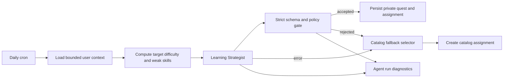

# AI Daily Quest Generation Design

**Date:** 2026-07-20  
**Status:** Approved for implementation planning  
**Scope:** User-specific AI-generated daily quests only

## Goal

Generate one clear, measurable, user-specific daily quest through the Learning Strategist while preserving deterministic authority over eligibility, safety, persistence, rewards, deadlines, and fallback behavior.

The first release does not generate mainline, checkpoint, penalty, or recovery quests. Every generated daily quest must require evidence. Resources are optional when the quest is sufficiently self-contained.

## Decisions

- Use real-time generation during the existing daily cron.
- Generate private quests for one user; never add them to the shared catalog.
- Require at least one supported, mandatory evidence item.
- Allow zero resources. Referenced resources must exist and be usable.
- Reject invalid proposals instead of repairing them with a second model call.
- Fall back to the existing hardest-feasible catalog selector on any AI or policy failure.
- Keep XP, skill changes, completion, verification, deadlines, and penalties deterministic.
- Do not introduce an MCP server. Next.js server code builds bounded context and calls the existing OpenAI gateway.

## Architecture

The daily cron remains the only scheduled entry point. It loads a bounded user context, asks the Learning Strategist for a structured quest proposal, passes the proposal through a deterministic policy gate, and atomically persists an accepted private quest with its assignment. Any failure is recorded and routed to the existing catalog selector.

### Responsibility boundaries

- **Daily cron:** idempotent orchestration; at most one daily assignment per user and local date.
- **Context builder:** exposes only the profile, seven skill values, recent daily outcomes, portfolio gaps, computed target difficulty, and a bounded resource set.
- **Learning Strategist:** proposes quest content only.
- **Policy gate:** accepts or rejects the proposal using deterministic rules.
- **Persistence service:** supplies trusted fields and creates the private quest and assignment together.
- **Catalog selector:** guarantees the established fallback path.
- **Diagnostics:** records model execution, policy outcome, fallback reason, latency, tokens, prompt version, and trace ID.

The model cannot set user identity, quest identity, XP, assignment status, deadline, penalty, verification status, or skill rewards.

## AI proposal contract

The strict structured response contains:

- `title`: a concrete action-oriented title.
- `summary`: the problem and intended outcome.
- `instructions`: self-contained execution guidance.
- `questType`: one of the seven existing quest types.
- `difficulty`: no greater than the supplied deterministic ceiling.
- `estimatedMinutes`: an integer from 1 through 60.
- `executionSteps`: three to five ordered actions.
- `acceptanceCriteria`: three to five observable checks.
- `successMetrics`: one to three concrete measurements.
- `evidenceRequirements`: one to three supported requirements, including at least one required item.
- `skillWeights`: all seven skill weights, each between zero and one, totaling 0.99 through 1.01.
- `expectedArtifactType`: one supported portfolio artifact type.
- `resourceIds`: zero to three IDs from the supplied context.
- `outOfScope`: one to three boundaries that prevent scope expansion.

The model receives supported enum values and must return English content. Extra response fields are rejected.

## Deterministic policy gate

An AI proposal is accepted only when all checks pass:

1. The strict response schema parses successfully.
2. Estimated time does not exceed 60 minutes.
3. Difficulty does not exceed `difficultyCeiling()` for the current user.
4. Execution steps and acceptance criteria each contain three to five non-empty items.
5. At least one concrete success metric exists.
6. At least one evidence requirement is marked required and uses a supported evidence type.
7. Skill weights total between 0.99 and 1.01.
8. Every referenced resource exists in the bounded context, is usable, and overlaps a targeted skill.
9. The normalized title and material terms are not substantially duplicated across the user's seven most recent daily quests.
10. The quest does not require paid-only access, secrets, destructive actions, or unsupported external authority.
11. The task names a concrete output or output format in its instructions, steps, criteria, metrics, or evidence.

The first duplicate check uses deterministic normalized token overlap and does not add an embedding request.

Primary rejection codes are:

- `invalid_schema`
- `over_difficulty_ceiling`
- `missing_required_evidence`
- `unmeasurable_acceptance`
- `duplicate_recent_quest`
- `invalid_resource_reference`
- `unsafe_or_paid_dependency`

The gate returns one primary code plus safe diagnostic details. It does not rewrite a rejected proposal.

## Trusted quest fields

After acceptance, server code supplies:

- a unique quest ID;
- `owner_user_id`;
- `source = ai_generated`;
- `purpose = training`;
- `scope = daily`;
- `duration_days = 1`;
- `optional = false`;
- the user's active training contract;
- deterministic `base_xp` derived from existing reward policy;
- generation model, prompt version, trace ID, and timestamps;
- a 24-hour assignment deadline.

## Database and privacy

The `quests` table gains:

- `owner_user_id uuid null references auth.users(id) on delete cascade`
- `source text not null default 'catalog'` constrained to `catalog | ai_generated`
- `generation_trace_id text null`
- `generation_model text null`
- `generation_prompt_version text null`

A catalog quest has no owner. An AI-generated quest must have an owner. A database check constraint enforces this relationship.

The existing broad authenticated quest-read policy is replaced so authenticated users can read catalog quests or quests where `owner_user_id = auth.uid()`. Clients cannot insert or update generated quests. The server-side persistence path uses privileged credentials.

Because the service-role client bypasses RLS, repository queries must also explicitly select only catalog quests and the current user's private quests. Privacy cannot rely on RLS alone.

Persistence must avoid orphaned generated quests. A database function or equivalent atomic server operation creates the generated quest and assignment together while respecting the existing daily generation key.

## Daily data flow

For each onboarded learner:

1. Derive the learner's local date and check for an existing daily assignment.
2. Preserve penalty priority; do not generate a daily quest while open penalty debt blocks assignment.
3. Load the training snapshot, seven recent daily quests and outcomes, portfolio artifact categories, and no more than ten relevant resources.
4. Compute the difficulty ceiling and target weak skills deterministically.
5. Call the Learning Strategist once.
6. Parse and validate the proposal.
7. Persist an accepted generated quest and assignment atomically.
8. On configuration, transport, parsing, policy, or persistence failure, use the existing catalog selector.
9. Record generation diagnostics and the final source.

There is no AI retry in the first release. One user's failure does not stop processing other users.

## Error and fallback behavior

- Missing API key: catalog fallback and degraded diagnostic.
- OpenAI timeout or transport error: catalog fallback.
- Invalid JSON or schema: catalog fallback.
- Policy rejection: catalog fallback with the rejection code.
- Generated quest persistence failure: no orphan quest; catalog fallback where safe.
- No eligible catalog fallback: retain the existing `resource_gap` outcome and create no empty assignment.
- Duplicate cron execution: return the existing assignment outcome without another model call or insert.

## Observability

Generation diagnostics use the existing `agent_runs` model and identify the Learning Strategist run. They record:

- status (`completed`, `degraded`, or `failed` as supported by the current model);
- model and prompt version;
- latency and token counts;
- trace ID;
- whether fallback was used;
- sanitized context summary;
- accepted quest ID or primary rejection/error code.

The Agents screen should distinguish an AI-generated assignment from catalog fallback without exposing prompts, secrets, or private evidence.

## Testing and acceptance

### Positive cases

- A valid proposal creates exactly one private quest and one assignment.
- The saved quest contains three to five steps, three to five criteria, a measurable result, and required evidence.
- A quest with no resources can pass.
- Referenced resources pass only when they exist and are usable.
- The owner sees the generated quest in dashboard and detail views.
- A different authenticated user cannot read the quest.
- Replaying the cron for the same local date creates neither another quest nor another assignment.

### Negative cases

- More than 60 estimated minutes.
- Difficulty above the deterministic ceiling.
- Missing required evidence.
- Missing or non-concrete success measures.
- Invalid skill-weight total.
- Unknown or unusable resource ID.
- Substantial duplication of a recent daily quest.
- Paid-only, destructive, secret-dependent, or unsupported work.
- Missing API key, timeout, invalid JSON, or invalid schema.
- Assignment creation failure after quest creation is attempted.

Every negative case must either use the catalog fallback or return the established no-candidate outcome without leaving partial generated data.

### Verification commands

Implementation completion requires focused contract, policy, workflow, repository, RLS migration, and cron tests followed by the complete Vitest suite, ESLint, TypeScript type checking, production build, and migration static checks. Browser E2E is not required unless separately requested.

## Explicitly out of scope

- AI-generated mainline, checkpoint, penalty, calibration, or recovery quests.
- AI authority over rewards, verification, failure, reset, or punishment.
- Model retries, prompt repair loops, embeddings for duplicate detection, queues, workers, or MCP servers.
- New notification channels.
- Automatic publication of generated outcomes to the public portfolio.
